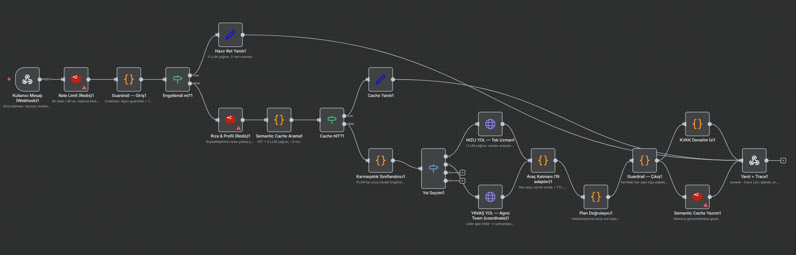
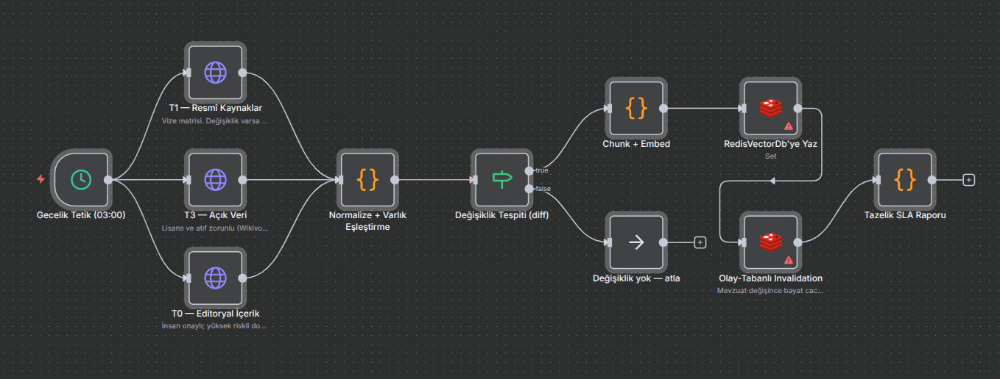

# n8n Görsel İş Akışları

Bu klasör, Pusula AI mimarisinin **n8n karşılığını** içerir. Case study "n8n, Langflow, Dify
gibi platformlardan ilham alınabilir" dediği için, `app/` altındaki çalışan Python
uygulamasının akışı bire bir görsel iş akışı olarak da modellendi.

İki akış var: istek anında çalışan **ana akış** ve gece çalışan **veri hattı**.

---

## 1. Ana akış — `pusula-ana-akis.json`

Kullanıcı mesajının girişten yanıta kadar izlediği yol. `app/team.py` içindeki
iki yollu akışın görsel karşılığı.

**Akışın okunuşu:**

| Aşama | Ne yapıyor |
|---|---|
| `Kullanıcı Mesajı (Webhook)` | Giriş katmanı — oturum, kullanıcı bağlamı |
| `Rate Limit (Redis)` | 30 istek / 60 sn. Aşılırsa kibarca reddedilir |
| `Guardrail — Giriş` | 3 katman: Agno guardrail + kapsam + PII |
| `Engellendi mi?` | Bloklandıysa **hazır ret yanıtı** → 0 LLM çağrısı, 0 veri sızıntısı |
| `Rıza & Profil (Redis)` | Kişiselleştirme rızası yoksa profil **okunmaz ve yazılmaz** |
| `Semantic Cache Arama` | HIT = 0 LLM çağrısı, ~3 ms |
| `Karmaşıklık Sınıflandırıcı` | Kural tabanlı, **sıfır LLM çağrısı** ile yol seçer |
| `HIZLI YOL — Tek Uzman` | 1 LLM çağrısı; uzman kendi araçlarını çağırır |
| `YAVAŞ YOL — Agno Team` | Lider ajan görevi böler → uzmanlara delege eder |
| `Araç Katmanı (19 adapter)` | Her araç cache-aside + TTL'li |
| `Plan Doğrulayıcı` | Halüsinasyona karşı son kapı — 9 denetim kodu |
| `Guardrail — Çıkış` | Yanıttaki **her sayı** bir olgu paketine dayanmak zorunda |
| `KVKK Denetim İzi` | Her erişim iz bırakır |
| `Semantic Cache Yazımı` | **Yalnızca groundedness denetiminden geçen** yanıt cache'lenir |
| `Yanıt + Trace` | `answer` + `trace` (yol, ajanlar, araçlar, kaynaklar) |

> Dikkat: cache yazımı çıkış guardrail'inden **sonra** duruyor. Doğrulanmamış bir yanıtın
> cache'e girip sonraki kullanıcılara servis edilmesi bu sırayla engelleniyor.

---

## 2. Veri hattı — `pusula-veri-hatti.json`

Yavaş değişen bilginin gecelik toplanması, doğrulanması ve vektör veritabanına yazılması.
`PLAN.md` §4'teki kademeli güven hiyerarşisinin ETL tarafı.

**Akışın okunuşu:**

| Aşama | Ne yapıyor |
|---|---|
| `Gecelik Tetik (03:00)` | Zamanlanmış batch |
| `T1 — Resmî Kaynaklar` | Vize matrisi. Değişiklik varsa olay tetiklenir |
| `T3 — Açık Veri` | Lisans ve atıf zorunlu (Wikivoyage CC BY-SA) |
| `T0 — Editoryal İçerik` | İnsan onaylı; yüksek riskli doğrulama buradan |
| `Normalize + Varlık Eşleştirme` | Wikidata QID ile kanonik destinasyon anahtarı |
| `Değişiklik Tespiti (diff)` | Değişmeyen kaynak **yeniden embed edilmez** — maliyet kontrolü |
| `Chunk + Embed` → `RedisVectorDb'ye Yaz` | Vektör indeksinin güncellenmesi |
| `Olay-Tabanlı Invalidation` | Mevzuat değişince bayat cache anında düşürülür |
| `Tazelik SLA Raporu` | Her kaynağın tazelik taahhüdü ölçülür ve raporlanır |

> Vize gibi yüksek riskli veride TTL beklemek yetmiyor. Bu yüzden hat, zamanlanmış
> tazelemenin yanında **olay-tabanlı invalidation** da içeriyor.

---

## İçe aktarma

n8n arayüzünde **Workflows → Import from File** ile `.json` dosyalarını yükleyin.

Akışlar **tasarım dokümanı** niteliğindedir: HTTP düğümleri `http://pusula/api/...`
gibi yer tutucu adresler ve kaynak açıklamaları içerir. Çalıştırmak için düğümlerdeki
adresleri kendi ortamınıza (`http://localhost:8000/...`) ve gerçek kaynak uçlarına
göre güncellemeniz gerekir. Kimlik bilgisi (credential) **bilinçli olarak
gömülmemiştir**.

Çalışan uygulama için kök dizindeki [`README.md`](../README.md)'ye bakın.
